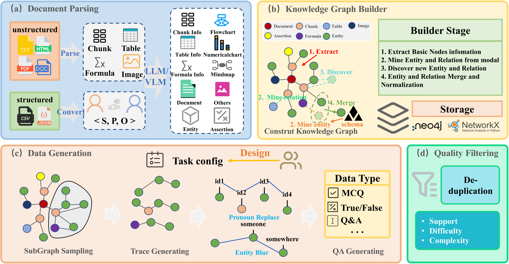
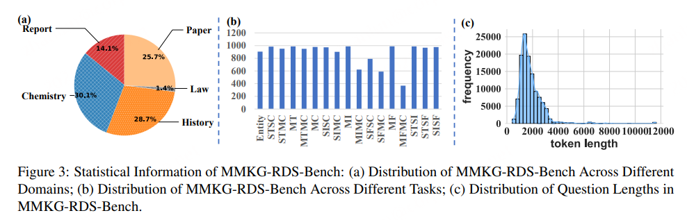

<div align="center">
  
  
  # MMKG-RDS
  
  ### 🧠 基于多模态知识图谱深度挖掘的推理数据合成
  [](https://arxiv.org/abs/2602.23632)
  [](https://opensource.org/licenses/Apache-2.0)
  [](https://www.python.org/)
  [](https://github.com/360AILAB-NLP/MMKG-RDS)
  
  [English](README.md) | [中文](README_zh.md)
</div>

---

## 📖 目录

- [概述](#-概述)
- [核心特性](#-核心特性)
- [流程](#-流程)
- [快速开始](#-快速开始)
- [项目结构](#-项目结构)
- [基准测试结果](#-基准测试结果)
- [引用](#-引用)
- [许可证](#-许可证)

---

## 🎯 概述

合成高质量训练数据对于提升领域模型的推理能力至关重要。现有方法在**长尾知识覆盖**、**有效性验证**和**可解释性**方面存在局限。基于知识图谱的方法在功能性、粒度、可定制性和评估方面仍有不足。

为解决上述问题，我们提出 **MMKG-RDS**——一个利用多模态知识图谱进行推理数据合成的灵活框架。它支持细粒度知识抽取、可定制路径采样以及多维度数据质量评分。

<div align="center">
  
</div>

### 🎓 MMKG-RDS-Bench 数据集

我们使用 **MMKG-RDS-Bench** 数据集对 MMKG-RDS 进行验证：
- 🔬 **5 个领域**（历史、有机化学、法律、股票研究报告及论文）
- 📝 **17 种任务类型**
- 📊 **14,950 条高质量样本**

**性能亮点**：在少量合成样本上微调 Qwen3 模型（0.6B/8B/32B），推理准确率提升 **9.2%**。该框架还能生成独特数据，在涉及表格和公式的任务上对现有模型构成挑战，适用于复杂基准构建。

---

## ✨ 核心特性

<table>
  <tr>
    <td width="50%">
      <h3>📚 数据预处理</h3>
      <ul>
        <li>统一处理<strong>结构化数据</strong>（JSON/CSV）</li>
        <li>支持<strong>非结构化文档</strong>（PDF/PNG/PPT/DOC）</li>
        <li>三元组转换与<strong>多模态内容抽取</strong></li>
        <li>提取文本、图像、表格和公式</li>
      </ul>
    </td>
    <td width="50%">
      <h3>🕸️ 知识图谱构建</h3>
      <ul>
        <li><strong>完全可定制的模式</strong></li>
        <li>实体-关系约束</li>
        <li>完整流程：抽取 → 消歧 → 规范化</li>
        <li>自动化知识图谱构建</li>
      </ul>
    </td>
  </tr>
  <tr>
    <td width="50%">
      <h3>💾 灵活存储</h3>
      <ul>
        <li>多种后端：<strong>Neo4j</strong>、NetworkX、JSON</li>
        <li>无缝 Neo4j 集成</li>
        <li>可视化与分析支持</li>
        <li>导出至标准格式</li>
      </ul>
    </td>
    <td width="50%">
      <h3>🎯 推理数据合成</h3>
      <ul>
        <li>知识图谱驱动的数据合成</li>
        <li><strong>子图采样</strong>与路径生成</li>
        <li>实体模糊化以增强鲁棒性</li>
        <li>可控 QA 生成，难度均衡</li>
      </ul>
    </td>
  </tr>
</table>

### 📊 质量分析与评估

- 🎚️ **多维度质量评估**：支持度、难度和复杂度指标
- 📈 **细粒度分析**：Token 分布、任务类型、领域覆盖
- 🔍 **综合评估**：自动化质量评分与验证

---

## 🔁 流程

统一流程，对多模态数据进行预处理，构建可定制知识图谱，并通过灵活存储和综合质量评估合成高质量推理数据集。

<div align="center">
  
</div>

**五阶段流程**：
1. 📄 **文档处理** 与知识图谱构建
2. 🔬 **数据生成**（基于图挖掘）
3. 🧹 **去重** 与质量评分
4. 📤 **数据导出** 至标准格式
5. 🎯 **模型评估** 与基准测试

---

## 🚀 快速开始

### 前置要求

- Python 3.8+
- LibreOffice（用于文档转换）
- 支持 CUDA 的 GPU（推荐）

### 1️⃣ 环境配置

**第一步：安装 LibreOffice**
```bash
sudo apt-get update
sudo apt-get install libreoffice
```

**第二步：安装中文字体**（可选，用于中文文档处理）
```bash
# 检查是否已安装中文字体
fc-list :lang=zh

# 将字体复制到系统目录
sudo cp ./fonts/msyh.ttf /usr/share/fonts/
sudo fc-cache -fv
```

**第三步：安装 MinerU**
```bash
uv pip install -U "mineru[all]" -i https://mirrors.aliyun.com/pypi/simple
```

**第四步：安装 Python 依赖**
```bash
uv pip install -U -r requirements.txt
```

### 2️⃣ 配置设置

编辑配置文件 `configs/dev.yaml`：
```yaml
# 非结构化数据

data:
  input_dir: ./data/dev/ud
  output_dir: ./output_dir
  output_dir: ./output_dir
  structured_data: False
  enable_visual: True

# 启用通过实体名合并实体
enable_merge_entity_by_name: true

# 启用通过实体名的相似度合并实体
enable_merge_entity_by_sim: False
merge_entity_by_sim:
  threshold: 0.95
  # embedding_model: sentence-transformers/all-MiniLM-L6-v2

# 启用通过断言的相似度合并断言
enable_merge_assertion_by_sim: true
merge_assertion_by_sim:
  threshold: 0.95
  # embedding_model: sentence-transformers/all-MiniLM-L6-v2

# 版式解析和KG抽取相关配置
dataprocessing:
  enable_assertion_recall: true
  enable_entity_recall: true
  mineru:
    server_url: http://10.178.131.48:30000

  llm:
    api_key: EMPTY
    base_url:  
      - http://10.178.141.79:8000/v1
      - http://10.178.141.233:8000/v1
      - http://10.178.133.1:8000/v1
     
    model: Qwen3-235B-A22B-Instruct-2507
    max_concurrent_requests: 256

  vlm:
    api_key: EMPTY
    base_url: http://10.178.129.197:8000/v1
    model: Qwen3-VL-2B-Instruct
    max_concurrent_requests: 24
    max_tokens: 4096

embedding_model:
  api_key: EMPTY
  base_url: http://10.178.131.43:9000/v1
  model: qwen3_embedding

# 数据合成相关配置
subgraph_sampling:
  sampling_algorithm: no_subgraph_sampling
  order: 100
  subgraph_num: 4
  kwargs:
    arg1: value1
    arg2: avlue2


trace_generation:
  selection_method: dfs
  node_types: ['Entity','Table','Image','Formula'] # ['Document','Chunk','Assertion','Entity','Table','Image','Formula']
  max_steps: 4
  num_traces: 4
  min_deg: 0
  max_deg: 200
  mode: in
  kwargs:
    arg1: value1
    arg2: avlue2


data_synthesis:
  api_key: EMPTY
  base_url:  
      - http://10.178.141.79:8000/v1
      - http://10.178.141.233:8000/v1
      - http://10.178.133.1:8000/v1
    
  model: Qwen3-235B-A22B-Instruct-2507
  task_type: multi_hop_tif
  max_concurrent_requests: 5

# QA质量过滤相关配置
evaluation_models:
  support_models:
    # 支持度评估模型列表（可以配置多个，支持多数投票）
    - model: Qwen3-VL-2B-Instruct           # 支持度评估用模型名称
      base_url: http://10.178.129.197:8000/v1  # 模型服务的 HTTP 基础地址
      api_key: EMPTY                        # 鉴权用的 API Key（本地服务可为空或固定占位）
      max_tokens: 1024                      # 单次调用允许的最大生成 token 数
    - model: Qwen3-VL-2B-Instruct           # 第二个支持度评估模型
      base_url: http://10.178.129.197:8000/v1
      api_key: EMPTY
      max_tokens: 1024
    - model: Qwen3-VL-2B-Instruct           # 第三个支持度评估模型
      base_url: http://10.178.129.197:8000/v1
      api_key: EMPTY
      max_tokens: 1024

  difficulty_models:
    # 难度评估使用的模型配置，分为 strong / weak 两个角色
    strong:
      model: Qwen3-VL-2B-Instruct           # strong模型
      base_url: http://10.178.129.197:8000/v1
      api_key: EMPTY
      max_tokens: 1024
    weak:
      model: Qwen3-VL-2B-Instruct           # weak模型
      base_url: http://10.178.129.197:8000/v1
      api_key: EMPTY
      max_tokens: 1024

  # 新增：复杂度评估使用的大模型配置
  complexity_model:
    #评估evaluate_complex的模型（负责对指令复杂度打 1~5 分）
    model: Qwen3-VL-2B-Instruct
    base_url: http://10.178.129.197:8000/v1
    api_key: EMPTY
    max_tokens: 1024

evaluation:
  batch_size: 3        # 每次并发评估的样本数量
  modes:
    - support               # 启用知识支持度评估
    - difficulty            # 启用难度评估
    - complexity            # 启用复杂度评估

  support:
    mode: majority_vote     # 支持度评估模式：majority_vote（多模型投票）或 single（单模型）
    models: [0, 1, 2]       # 使用 support_models 列表中的哪些模型（按下标选择）

  difficulty:
    mode: strong_weak       # strong_weak（强弱模型同时使用），也可设为 strong_only / weak_only

  complexity:
    enabled: true           # 是否启用复杂度评估
```

### 3️⃣ 运行项目
```bash
python main.py 
```

**或运行特定领域示例**：
```bash
# 法律领域示例
python main_law.py
```

---

## 📁 项目结构
```
MMKG-RDS/
│
├── 📄 main.py                          # 主入口（五阶段流程）
├── 📄 main_law.py                      # 法律领域示例
├── 📄 requirements.txt                 # Python 依赖
├── 📄 README.md                        # 项目文档
│
├── 📂 assets/                          # 资源文件
│   ├── logo.png                        # 项目 Logo
│   ├── framwork.png                    # 框架图
│   └── pipeline.png                    # 流程可视化
│
├── 📂 config/                          # 配置文件
│   ├── dev.yaml                        # 开发配置
│   └── test.yaml                       # 测试配置
│
├── 📂 data/                            # 原始数据目录
│   ├── chemistry/                      # 化学领域数据
│   ├── law/                            # 法律领域数据
│   └── ...                             # 其他领域
│
├── 📂 schema/                          # 模式定义
│   ├── chemistry.schema                # 化学领域模式
│   └── test.schema                     # 测试模式
│
├── 📂 processor/                       # 数据处理模块
│   ├── processor.py                    # 主处理器
│   ├── node.py                         # 节点处理
│   ├── edge.py                         # 边处理
│   ├── modal.py                        # 模态数据处理
│   └── chunk.py                        # 文本分块
│
├── 📂 data_synthesis/                  # 数据合成核心
│   ├── generate_qa.py                  # QA 生成
│   ├── subgraph_sampling.py            # 子图采样
│   ├── trace_generate.py               # 路径生成
│   ├── information_blur.py             # 实体模糊化
│   ├── filter.py                       # 数据过滤
│   └── constants.py                    # 任务定义
│
├── 📂 llms/                            # LLM 客户端
│   ├── client.py                       # OpenAI 兼容客户端
│   ├── vision_client.py                # 视觉模型客户端
│   └── emb.py                          # 嵌入客户端
│
├── 📂 eval/                            # 评估模块
│   ├── eval_up.py                      # LLM 评估
│   └── eval_up_vl.py                   # 视觉语言评估
│
├── 📂 qafilter/                        # QA 过滤
│   └── enhanced_refactored_pipeline.py # 增强过滤流程
│
├── 📂 prompts/                         # 提示词模板
│   ├── dataprocess_prompt.py           # 数据处理提示词
│   ├── datasynthesis_prompt.py         # 数据合成提示词
│   └── task_prompt.py                  # 任务专用提示词
│
├── 📂 util/                            # 工具函数
│   ├── pdf2md.py                       # PDF 转 Markdown
│   ├── any2pdf.py                      # 转换为 PDF
│   ├── json2graph.py                   # JSON 转图
│   ├── export2std_data.py              # 导出为标准格式
│   └── tool.py                         # 通用工具
│
└── 📂 outputs/                         # 输出目录
    ├── data_gene.json                  # 生成数据
    ├── data_filter.json                # 过滤后数据
    ├── data_filter_statistics.json     # 统计信息
    └── graph.graphml                   # 图数据
```

---

## 📊 基准测试结果

### MMKG-RDS-Bench 数据分布
<div align="center">
  
</div>

### 各模型在不同任务上的性能表现

<div align="center">
  
</div>

### 合成数据微调实验
| 模型       | 基础准确率 | 微调后准确率 | 提升幅度   |
| ---------- | ---------- | ------------ | ---------- |
| Qwen3-0.6B | 39.7%      | 51.5%        | **+11.8%** |
| Qwen3-8B   | 59.0%      | 65.6%        | **+6.6%**  |
| Qwen3-32B  | 58.7%      | 67.9%        | **+9.2%**  |

---

## 📚 引用

如果您在研究中使用了 MMKG-RDS，请引用：
```bibtex
@misc{zhan2026mmkgrdsreasoningdatasynthesis,
      title={MMKG-RDS: Reasoning Data Synthesis via Deep Mining of Multimodal Knowledge Graphs}, 
      author={Lun Zhan and Feng Xiong and Huanyong Liu and Feng Zhang and Yuhui Yin},
      year={2026},
      eprint={2602.23632},
      archivePrefix={arXiv},
      primaryClass={cs.AI},
      url={https://arxiv.org/abs/2602.23632}, 
}
```

---

## 🤝 贡献

欢迎贡献！详情请参阅 [贡献指南](CONTRIBUTING.md)。

---

## 📄 许可证

本项目基于 Apache License 2.0 许可证——详情请参阅 [LICENSE](LICENSE) 文件。

---

## 🙏 致谢

- 文档处理基于 [MinerU](https://github.com/opendatalab/MinerU) 构建
- 知识图谱存储由 [Neo4j](https://neo4j.com/) 驱动
- LLM 集成通过 [OpenAI API](https://openai.com/) 实现

---

<div align="center">
  
  **⭐ 在 GitHub 上给我们点 Star——这对我们很有激励！**
  
  [报告问题](https://github.com/360AILAB-NLP/MMKG-RDS/issues) · [请求功能](https://github.com/360AILAB-NLP/MMKG-RDS/issues) · [文档](https://mmkg-rds.readthedocs.io/)
  
</div>